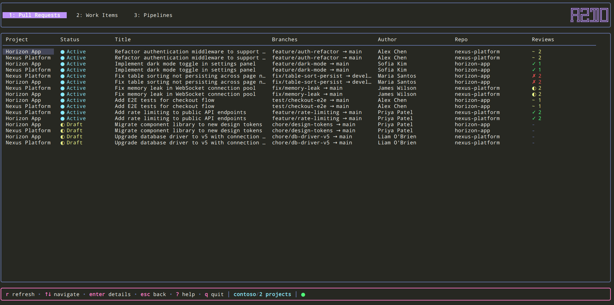

# azdo

A Terminal User Interface (TUI) for Azure DevOps and GitHub - manage pull requests, work items, and pipelines directly from your terminal.

Point it at Azure DevOps projects, GitHub repositories, or both at once: lists fan out across every configured backend and detail actions route back to the right one. A small glyph (⬢ Azure, ⎇ GitHub) marks each row's origin only when a list mixes backends.


## Table of Contents

- [Installation](#installation)
- [Features](#features)
- [Demo Mode](#demo-mode)
- [CLI Usage](#cli-usage)
- [Configuration](#configuration)
- [Keyboard Shortcuts](#keyboard-shortcuts)
- [Technology Stack](#technology-stack)
- [Development](#development)
- [FAQ](#faq)
- [Contributing](#contributing)
- [License](#license)

## Installation

### Quick Install (Recommended)

**Linux / macOS:**
```bash
curl -fsSL https://raw.githubusercontent.com/Elpulgo/azdo/main/install.sh | sh
```

**Windows (PowerShell):**
```powershell
irm https://raw.githubusercontent.com/Elpulgo/azdo/main/install.ps1 | iex
```

The install scripts will automatically:
- Detect your OS and architecture
- Download the latest release from GitHub
- Install the binary to the appropriate location
- Create a config file with placeholder values
- Verify the download checksum

**Install options:**
```bash
# Install a specific version
curl -fsSL https://raw.githubusercontent.com/Elpulgo/azdo/main/install.sh | sh -s -- --version v0.1.0

# Install to a custom directory
./install.sh --install-dir ~/bin
```

### Manual Download

Download the latest release for your platform from the [Releases page](https://github.com/Elpulgo/azdo/releases).

| Platform | Architecture | File |
|----------|-------------|------|
| Linux    | x86_64      | `azdo_*_Linux_x86_64.tar.gz` |
| Linux    | ARM64       | `azdo_*_Linux_arm64.tar.gz` |
| macOS    | x86_64      | `azdo_*_Darwin_x86_64.tar.gz` |
| macOS    | ARM64 (M1+) | `azdo_*_Darwin_arm64.tar.gz` |
| Windows  | x86_64      | `azdo_*_Windows_x86_64.zip` |
| Windows  | ARM64       | `azdo_*_Windows_arm64.zip` |

Extract the archive and move the binary to a directory in your `PATH`.

### From Source

```bash
git clone https://github.com/Elpulgo/azdo.git
cd azdo
go build -o azdo-tui ./cmd/azdo-tui
```

### Using Go Install

```bash
go install github.com/Elpulgo/azdo/cmd/azdo-tui@latest
```

## Features

### Backends
- **Azure DevOps** — projects via WIQL queries and the REST v7.1 API
- **GitHub** — repositories via REST + GraphQL; issues map to work items, labels map to item type / priority / tags, pull-request reviews map to votes, and GitHub Actions runs map to pipelines
- **Mix freely** — configure Azure projects, GitHub repos, or both. Every list view fans out across all configured backends; the per-row origin glyph (⬢ / ⎇) appears only when a list actually mixes backends
- See [Configuration](#configuration) for how to set up each backend

### Multi-Tab Interface
- **Notifications** (Tab 1, GitHub only): Your GitHub inbox as an attention feed — see [Notifications](#notifications-github-only) below
- **Pull Requests** (Tab 2): View and track pull requests
- **Work Items** (Tab 3): Browse and manage work items (GitHub issues appear here too)
- **Pipelines** (Tab 4): Monitor and drill into pipeline runs (GitHub Actions runs appear here too)
- Switch between tabs using the number keys or `←`/`→` arrow keys — only enabled tabs are numbered, so the exact digits shift with your config

### Notifications (GitHub only)

A default-on "what needs me now" pane rendering your GitHub notifications inbox. It's the
first tab, but only when at least one configured backend supports it — in this phase that
means **GitHub only**; Azure DevOps has no equivalent inbox API, so an Azure-only config
never shows the tab (Azure support is a later phase). The tab reappears on its own once a
future release adds Azure support — no config change needed.

- One merged feed across every backend that supports it, sorted newest-first
- Columns are `● | Repo | Reason | Title | Updated`. Unread rows carry a `●` marker and a
  bold title; read rows are unmarked. The Repo column is always shown, even when every
  visible row is from the same repo — this pane is a cross-repo inbox, so which repo a
  row belongs to is primary context and shouldn't disappear when a filter narrows the feed
- Rows from repos you haven't configured are shown too — `o` opens them in the browser
- `f` cycles the reason filter (review requested, mentioned, assigned, authored, commented,
  state changed, CI activity, security alert, approval requested, subscribed, other) —
  only reasons present in the current feed are offered, and there's always an "all reasons"
  position
- `u` marks the selected row read — the `●` marker clears (one-way; GitHub has no
  mark-unread endpoint). With `unread_only: false` the row stays in place, unmarked
- `d` marks the selected row done (removes it from the feed)
- `o` opens the selected row in your browser
- An unread-count badge appears in the footer from every tab, after your config filters
  are applied, and hides entirely at zero
- Polls on its own cadence, honoring GitHub's `X-Poll-Interval` hint so conditional
  requests never count against your rate limit harder than necessary
- See [Notifications Configuration](#notifications-configuration) below for every filter
  knob, and [GitHub — Personal Access Token](#github--personal-access-token) for the
  required token scope

### Pull Requests
- List view of pull requests with status indicators
- Filter to show only your created PRs (`m` key) or PRs where you're a reviewer (`A` key)
- Detailed view showing PR information and metadata
- Vote on PRs directly from the detail view. The picker is backend-aware: Azure exposes the full five-level scale (approve, approve with suggestions, wait for author, reject, reset), while GitHub offers just Approve / Request changes to match its review model
- **Code review**: Diff viewer with file-by-file navigation
- Inline commenting, thread replies, and thread resolution
- General (non-file-specific) comments

### Work Items
- List view of work items with status and type information
- Detailed view showing work item details
- View the Discussion (comments) below the description, newest first
- Add comments from the detail view (`c` key, multi-line form)
- Change work item state directly from the detail view (dynamically fetches available states)
- Filter to show only your assigned items
- Filter by tag (`T` key)
- Filter by state (`s` key)

### Pipeline Dashboard
- View recent pipeline runs in a sortable table
- Color-coded status indicators (✓ Success, ✗ Failed, ● Running, ○ Queued)
- Filter by status (`S` key)
- Live auto-refresh with configurable polling interval
- Connection status indicator in footer
- Hierarchical detail view with stages, jobs, and tasks
- Duration tracking for each step
- Full log viewer with scrollable viewport

### Metrics Dashboard (opt-in)

A management view for team leads, **disabled by default**. Enable it via `metrics.enabled: true` in `config.yaml` and a fourth tab appears.

> **Azure DevOps only.** Metrics relies on WIQL queries and work-item revision history (`/updates`), so it reads from your Azure projects directly and ignores any configured GitHub repos.

Two sub-views, toggled with `v`:

- **Live** — current-state dwell per work item, per-user roll-up (WIP, in-flight, oldest Active / Ready for Test, points closed in the configured interval), and a worst-first "stuck items" pane. Sourced from the live work-item fetch — no local state, on-demand refresh only.
- **Trends** — sprint-on-sprint comparison from a local 90-day snapshot file. Pick any combination of sprint tags with `T` (multi-select; space toggles, enter confirms) and see per-user **points closed**, **average WIP**, **stuck count**, and **cycle time** side-by-side. Values are colored: green for closed points, yellow when overloaded, red for stuck items.

The snapshot file lives at `~/.config/azdo-tui/metrics.jsonl`. One row per work item per day is appended on first metrics-tab launch each day, then pruned to a 90-day window. No database — append-only JSONL.

**One-shot backfill (optional).** A fresh install starts with an empty snapshot file, so the Trends view shows "Insufficient snapshot history" for the first ~2 sprints. To seed the file from your team's actual recent history, set:

```yaml
metrics:
  run_one_shot_backfill: true
```

On the next launch the tab walks every in-flight or recently-closed work item across all configured projects, reads each item's revision history via `/updates`, and synthesizes daily snapshot rows back 90 days. The footer reports progress and the result. A marker file (`~/.config/azdo-tui/.metrics-backfill-done`) prevents re-running — delete it if you want to re-seed. Flip the flag back to `false` once it's done so the footer hint stops appearing.

### User Experience
- **Setup wizard** on first run guides you through configuration
- Help modal with all keyboard shortcuts (press `?`)
- Secure token storage using system keyring (Azure PAT and GitHub token)
- Context-aware keybinding hints
- Graceful error handling with automatic retry
- Eight built-in themes with true color support
- **Theme switcher** modal (press `t`) to change themes on the fly
- **Multi-project and multi-repo support** across Azure DevOps and GitHub, with display name customization
- **State persistence** — remembers the last active tab and the last opened PR / work item detail across sessions, so you can pick up where you left off

## Demo Mode

Want to try azdo without an Azure DevOps or GitHub account? Run the demo — no configuration, no token, no setup required:

```bash
azdo demo
```

This launches the full TUI with realistic mock data (two fictional projects, pull requests with diffs, work items, pipeline runs with logs). All features work — you can navigate, view details, switch themes, and explore the UI. Perfect for evaluating the tool or taking screenshots.



See more screenshots in the [screenshots](screenshots/) folder.

## CLI Usage

```bash
# Start the TUI
azdo

# Try it out with mock data (no setup needed)
azdo demo

# Set or update credentials (prompts for the backend: Azure PAT or GitHub token)
azdo auth

# Show version
azdo --version

# Show help
azdo --help
```

## Configuration

### 1. Create Configuration File

When running azdo for the first time, a **wizard setup** will help you setup this.
Otherwise follow these instructions.

Create a configuration file at the following location:
- **Linux/macOS**: `~/.config/azdo-tui/config.yaml`
- **Windows**: `C:\Users\<username>\.config\azdo-tui\config.yaml`

Configure at least one backend — Azure DevOps, GitHub, or both.

```yaml
# ── Azure DevOps (optional; required only if you use Azure) ──────────────
# Organization name. Required when any Azure projects are listed.
organization: your-org-name

# Azure DevOps project name(s).
# Simple format:
projects:
  - your-project-name

# With display names (friendly name shown in UI):
#   projects:
#     - name: ugly-api-project-name
#       display_name: My Project
#     - name: ugly-api-project-name-2
#       display_name: My Project 2

# ── GitHub (optional; required only if you use GitHub) ───────────────────
# One or more "owner/repo" slugs. Listing at least one enables the GitHub
# backend. Issues become work items, PRs become pull requests, and Actions
# runs become pipelines.
# github:
#   repos:
#     - your-org/your-repo
#     - your-org/another-repo
#   # Label prefixes used to derive a work item's type and priority from
#   # GitHub issue labels (case-insensitive). Defaults shown; omit to use them.
#   type_prefix: "type:"        # e.g. "type:bug" → Bug, "type:feature" → Feature
#   priority_prefix: "priority:" # e.g. "priority:p1" or "priority:1" → priority 1
#   # Labels that match neither prefix are shown as tags.

# Polling interval in seconds (optional, default: 60)
polling_interval: 60

# Theme (optional, default: dark)
# Available themes: dark, gruvbox, nord, dracula, catppuccin, github, retro, monokai
theme: dark

# Disable specific panes (optional, comma-separated)
# Valid values: pullrequests, pipelines, workitems, notifications
# At least one pane must remain enabled.
# disabled_panes: pipelines,workitems

# Notifications tab (GitHub only; on by default whenever github.repos is set).
# There is no notifications.enabled key — add "notifications" to
# disabled_panes above to turn the tab off. See "Notifications Configuration"
# below for the full reference.
# notifications:
#   only_configured_repos: false
#   exclude_repos: []
#   include_repos: []
#   exclude_reasons: []
#   unread_only: false
#   participating_only: false
#   since_days: 0
#   max_items: 0
#   poll_interval: 0

# Tab labels (optional). Override the name shown for any tab, in both the tab
# bar and the help dialog. Keys are lowercase snake_case; unset tabs keep their
# defaults.
# terms:
#   pull_requests: PRs
#   work_items: Tasks
#   pipelines: Builds
#   metrics: Dashboard

# Metrics dashboard (opt-in, management feature). Hidden unless enabled.
# See "Metrics Configuration" below for the full reference.
# metrics:
#   enabled: false
#   interval_days: 14            # window for the Live "closed pts" column
#   active_stale_days: 3         # dwell in Active above this flags the item
#   rft_stale_days: 2            # dwell in Ready for Test above this flags the item
#   wip_limit: 4                 # in-flight strictly above this marks a user overloaded
#   run_one_shot_backfill: false # one-time /updates seed (see Features → Metrics)
#   states:                      # your board's actual state names (case-insensitive)
#     active: Active
#     ready_for_test: Ready for Test
#     closed: Closed
#   state_labels:                # optional column-header overrides (auto-derived if omitted)
#     active: active
#     ready_for_test: rft
#     closed: closed
```

**Configuration Options:**
- `organization`: Your Azure DevOps organization name. Required when `projects` is set.
- `projects`: List of Azure DevOps project names. Each entry can be a plain string or an object with `name` and `display_name` fields. The `display_name` is shown in the TUI while the `name` is used for API calls.
- `github.repos`: List of GitHub `owner/repo` slugs. Listing at least one enables the GitHub backend.
- `github.type_prefix`: Label prefix used to derive a work item's type from GitHub issue labels (optional, default: `type:`). A label like `type:bug` maps to Bug; recognised values are bug, task, story / user story, feature, epic, issue. An unrecognised value (e.g. `type:chore`) is kept as a tag instead.
- `github.priority_prefix`: Label prefix used to derive priority from GitHub issue labels (optional, default: `priority:`). Accepts `p1`–`p4` or bare `1`–`4`; anything else is kept as a tag.
- **At least one backend is required** — set Azure (`organization` + `projects`), GitHub (`github.repos`), or both.
- `polling_interval`: How often to refresh data in seconds (optional, default: 60)
- `theme`: Color theme for the UI (optional, default: dark)
- `disabled_panes`: Comma-separated list of panes to hide (optional). Valid values: `pullrequests`, `pipelines`, `workitems`, `notifications`. When a pane is disabled, its tab, keyboard shortcuts, and all related UI are removed, and remaining tabs are renumbered. At least one pane must remain enabled — a GitHub-only config with only `notifications` enabled is valid. Adding or removing `notifications` here only takes effect on the **next restart**; the tab list is computed once at startup.
- `terms`: Map of tab label overrides (optional). Keys are lowercase snake_case (`pull_requests`, `work_items`, `pipelines`, `metrics`); the value replaces the tab's name in both the tab bar and the help dialog. Unset tabs keep their default labels.
- `metrics`: Opt-in management dashboard. See [Metrics Configuration](#metrics-configuration) below for the full reference, and [Features → Metrics Dashboard](#metrics-dashboard-opt-in) for what it does.
- `notifications`: Default-on GitHub inbox pane (no `enabled` key — see `disabled_panes` above to turn it off). See [Notifications Configuration](#notifications-configuration) below for the full reference, and [Features → Notifications](#notifications-github-only) for what it does.

**Available Themes:**
- `dark` - Dark theme with blue and cyan accents
- `gruvbox` - Retro groove color scheme
- `nord` - Arctic, north-bluish color palette
- `dracula` - Default dark theme with purple and pink accents
- `catppuccin` - Soothing pastel theme (Mocha variant)
- `github` - GitHub Dark theme
- `retro` - Matrix-inspired green phosphor on black
- `monokai` - Classic Monokai color scheme

### Metrics Configuration

The metrics dashboard is **opt-in and hidden entirely** unless `metrics.enabled: true`. All keys live under the top-level `metrics:` block and are optional — the defaults below apply when a key is omitted. The validation rules only apply when `enabled` is `true`.

| Key | Type | Default | Description |
|---|---|---|---|
| `metrics.enabled` | bool | `false` | Master switch. The whole tab is hidden when `false`. |
| `metrics.interval_days` | int | `14` | Look-back window (days) for points-closed / velocity. Must be `> 0`. |
| `metrics.active_stale_days` | int | `3` | Dwell in Active longer than this flags the item as stuck. Must be `>= 0`. |
| `metrics.rft_stale_days` | int | `2` | Dwell in Ready-for-Test longer than this flags the item as stuck. Must be `>= 0`. |
| `metrics.wip_limit` | int | `4` | In-flight items *strictly above* this marks a user overloaded (⚠). Must be `> 0`. |
| `metrics.run_one_shot_backfill` | bool | `false` | One-time 90-day `/updates` seed of history on next launch. A marker file prevents it re-running. |

#### State names — `metrics.states`

These map your board's **actual workflow-state strings** onto the three buckets the metrics engine tracks. Matching is **case-insensitive and whitespace-trimmed**, but each takes a **single name** (no comma-separated aliases). If your board doesn't literally use "Active" / "Ready for Test" / "Closed", set these or the metrics tab will bucket nothing.

| Key | Default |
|---|---|
| `metrics.states.active` | `Active` |
| `metrics.states.ready_for_test` | `Ready for Test` |
| `metrics.states.closed` | `Closed` |

Each name must be non-empty, **distinct** from the other two, and contain no single quote (`'`) — single quotes are rejected for WIQL-injection safety.

#### Column labels — `metrics.state_labels` (optional)

Display-only overrides for the metrics table column headers. When omitted, labels are **auto-derived** from the configured state name: multi-word names become lowercased initials (`Ready for Test` → `rft`, `In Progress` → `ip`), single-word names are lowercased as-is (`Done` → `done`).

| Key | Falls back to |
|---|---|
| `metrics.state_labels.active` | derived from `states.active` |
| `metrics.state_labels.ready_for_test` | derived from `states.ready_for_test` |
| `metrics.state_labels.closed` | derived from `states.closed` |

**Example — a board using "Doing" / "QA" / "Done":**

```yaml
metrics:
  enabled: true
  interval_days: 14
  wip_limit: 4
  states:
    active: Doing
    ready_for_test: QA
    closed: Done
  state_labels:
    ready_for_test: QA   # override the auto-derived lowercase "qa" to keep the caps
```

### Notifications Configuration

The Notifications tab is **on by default** whenever GitHub is configured (`github.repos`
has at least one entry) — there is deliberately no `notifications.enabled` key. To turn it
off, add `notifications` to `disabled_panes` instead (see [Configuration
Options](#configuration) above); either way it takes effect on the **next restart**, not
immediately. All keys live under the top-level `notifications:` block and are optional —
every default is the widest possible behaviour (whole inbox, nothing filtered).

| Key | Type | Default | Description |
|---|---|---|---|
| `notifications.only_configured_repos` | bool | `false` | Narrow the feed to repos listed in `github.repos`. When `true`, this **overrides** `include_repos` (which is then ignored, with a startup warning) — the two selection knobs never intersect. |
| `notifications.include_repos` | []string | `[]` | Glob list (`path.Match` syntax, e.g. `your-org/*`) narrowing the feed to matching repos. Empty means no narrowing. Ignored when `only_configured_repos: true`. |
| `notifications.exclude_repos` | []string | `[]` | Glob list of repos to hide from the feed. Empty excludes nothing. |
| `notifications.exclude_reasons` | []string | `[]` | Reasons to drop from the feed — see "Reason values" below. |
| `notifications.unread_only` | bool | `false` | Show only unread rows. The fetch itself always requests the whole inbox regardless of this setting; filtering happens client-side. |
| `notifications.participating_only` | bool | `false` | Narrow the **server-side** fetch to GitHub's "participating" bundle (roughly everything except `subscribed`). Composes with `exclude_reasons` rather than replacing it — see "Precedence" below. |
| `notifications.since_days` | int | `0` (no bound) | Only show notifications updated within the last N days. This is the knob to reach for on a very large inbox — it's the one filter that actually reduces what's fetched from GitHub, rather than merely trimming the client-side result. |
| `notifications.max_items` | int | `0` (no cap) | Caps the number of notifications returned, applied after sorting newest-first. |
| `notifications.poll_interval` | int | `0` | Overrides the global `polling_interval` for the notifications poller only, in seconds. `0` falls back to GitHub's `X-Poll-Interval` response hint when present, else the global `polling_interval`. |

**Repo glob syntax.** `exclude_repos` / `include_repos` patterns are `path.Match` globs
against `owner/repo`, matched case-insensitively (both the pattern and the repo name are
lower-cased first). `*` does not cross `/` — write `*/*` to match everything, not `*`. A
pattern that fails to compile is dropped at load with a startup warning rather than
rejected outright, and an `include_repos` list that loses every pattern this way falls back
to showing the whole inbox rather than emptying it.

**Reason values.** `exclude_reasons` accepts the following eleven values, lowercase
snake_case, and they are **case-sensitive** — config keys are lowercased by viper on load,
but list *values* are passed through unchanged, so `Subscribed` does not match `subscribed`;
an unrecognised value (including a differently-cased one) produces a startup warning naming
the bad value and is then dropped rather than applied or treated as a hard config error:

`review_requested`, `mentioned`, `assigned`, `authored`, `commented`, `state_changed`,
`ci_activity`, `security_alert`, `approval_requested`, `subscribed`, `other`

`unknown` is **reserved and not accepted** — it exists internally as the enum's zero value
but nothing GitHub sends is ever mapped to it, so listing it in `exclude_reasons` can only
ever produce the same unrecognised-value warning as a typo.

**Precedence.** These five knobs are not a pipeline and their evaluation order is not
observable — each is an independent predicate over the row set, except for one genuine
override: `only_configured_repos` and `include_repos` are both *selection* knobs, and when
both are set, `only_configured_repos` wins outright (`include_repos` is ignored, with a
warning). `exclude_repos`, `exclude_reasons`, and `unread_only` are a plain, order-independent
AND — each one only ever removes rows, never adds them back, so it doesn't matter which is
"applied first".

```yaml
notifications:
  only_configured_repos: false
  exclude_repos:
    - "some-org/noisy-repo"
  exclude_reasons:
    - subscribed
    - ci_activity
  unread_only: false
  since_days: 30
  poll_interval: 120
```

### Custom Themes

You can create your own custom themes by placing JSON theme files in the themes directory:
- **Linux/macOS**: `~/.config/azdo-tui/themes/`
- **Windows**: `C:\Users\<username>\.config\azdo-tui\themes\`

**Creating a Custom Theme:**

1. Create the themes directory if it doesn't exist:
   ```bash
   mkdir -p ~/.config/azdo-tui/themes
   ```

2. Create a JSON theme file (e.g., `mytheme.json`):
   ```json
   {
     "name": "mytheme",
     "primary": "#0088ff",
     "secondary": "#00aaff",
     "accent": "#ff8800",
     "success": "#00ff88",
     "warning": "#ffaa00",
     "error": "#ff4444",
     "info": "#00ccff",
     "background": "#1a1b26",
     "background_alt": "#24283b",
     "background_select": "#343b58",
     "foreground": "#c0caf5",
     "foreground_muted": "#787c99",
     "foreground_bold": "#ffffff",
     "select_foreground": "#ffffff",
     "select_background": "#0088ff",
     "border": "#3b4261",
     "link": "#7aa2f7",
     "spinner": "#bb9af7",
     "tab_active_foreground": "#ffffff",
     "tab_active_background": "#0088ff",
     "tab_inactive_foreground": "#787c99"
   }
   ```

3. Set the theme in your `config.yaml`:
   ```yaml
   theme: mytheme
   ```

4. Restart the application to use your custom theme.

See `example-theme.json` in the repository for a complete template with all available color properties. Colors can be specified as:
- Hex values: `#ff0000` or `#f00`
- ANSI 256 colors: `"1"`, `"33"`, `"196"`

### State File

The application persists a small amount of navigation state between runs (last active tab, last opened PR / work item detail) so you land back where you left off. The file is written to:

- **Linux/macOS**: `$XDG_STATE_HOME/azdo-tui/state.yaml` if set, otherwise `~/.local/state/azdo-tui/state.yaml`
- **Windows**: `%USERPROFILE%\.local\state\azdo-tui\state.yaml`

The file is created lazily — no state file is required to run the app. Writes are debounced and flushed on clean exit (including SIGINT / SIGTERM / SIGHUP). Delete the file to reset the saved view.

### 2. Authentication

Run `azdo auth` and pick the backend you want to set credentials for (Azure DevOps or GitHub) — the first run prompts automatically. Configure whichever backend(s) you use. Tokens are securely stored in your system's credential manager:
- **Windows**: Windows Credential Manager
- **macOS**: Keychain
- **Linux**: Secret Service (gnome-keyring, KWallet, etc.)

If your system doesn't support a keyring, you can fall back to environment variables: `AZDO_PAT` for Azure DevOps and `GITHUB_TOKEN` for GitHub. To update credentials at any time, run `azdo auth`.

#### Azure DevOps — Personal Access Token (PAT)

**Required PAT Scopes:**
| Scope | Access | Used For |
|-------|--------|----------|
| **Build** | Read | Pipeline runs, build timelines, and logs |
| **Code** | Read & Write | List PRs, view threads/iterations/diffs, vote on PRs, add comments, and update thread status |
| **Work Items** | Read & Write | Query and view work items, read/add comments, fetch available states, and change work item state |

To create a PAT:
1. Go to Azure DevOps → User Settings → Personal Access Tokens
2. Click "New Token"
3. Select the required scopes
4. Copy the generated token

#### GitHub — Personal Access Token

A classic or fine-grained token works for most operations.

**Classic PAT** — https://github.com/settings/tokens:
| Scope | Used For |
|-------|----------|
| `repo` | Private repos: issues, pull requests, reviews, and Actions |
| `public_repo` | Public repos only (use instead of `repo`) |
| `notifications` | The Notifications tab: list, mark read, mark done (**classic only** — see note below) |

**Fine-grained token** — https://github.com/settings/personal-access-tokens — grant these
repository permissions:
| Permission | Access |
|------------|--------|
| Metadata | Read |
| Contents | Read |
| Issues | Read & write |
| Pull requests | Read & write |
| Actions | Read |

> **Note:** resolving PR comment threads requires a classic `repo` PAT — fine-grained tokens are commonly rejected for that operation.

> **The Notifications tab requires a classic PAT.** GitHub's notifications REST API
> [only supports classic tokens](https://docs.github.com/en/rest/activity/notifications) —
> there is no fine-grained permission that enables it, so don't go looking for one in the
> fine-grained token form. A fine-grained token is fine for everything else in the GitHub
> backend; it just can't reach the inbox. If you'd rather not switch, see [Disabling the
> Notifications tab](#notifications-configuration) — add `notifications` to
> `disabled_panes` and the tab goes away.

**Upgrading an existing token.** If you already have a GitHub token configured from before
the Notifications tab existed, it won't have the `notifications` scope and the tab will
show a "token scope required: notifications" error instead of your inbox. Edit the token at
https://github.com/settings/tokens, tick `notifications`, and run `azdo auth` to update the
stored token. If your existing token is fine-grained, you need a new classic one — see the
note above.

**Diagnosing a 403.** Classic tokens make GitHub send back which scopes are required and
which the token has, so a missing-scope 403 names both. Fine-grained tokens never send
those headers, so the exact same 403 shows up bare — and that absence is itself the
diagnosis: a bare 403 here almost always means the token is fine-grained and needs
replacing with a classic one. Note a 403 isn't always a scope problem either: a
rate-limited 403 is reported as a plain failure with no scope banner at all, since adding a
scope to an already-correct token wouldn't fix a rate limit.

To create a token:
1. Go to GitHub → Settings → Developer settings → Personal access tokens
2. Generate a classic or fine-grained token with the scopes above (classic if you want the
   Notifications tab)
3. Copy the generated token

## Keyboard Shortcuts

### Global
| Key | Action |
|-----|--------|
| `1`-`5` | Switch tabs (Notifications, PRs, Work Items, Pipelines, Metrics) — only enabled tabs are numbered, so which digit lands on which tab depends on your config |
| `←/→` | Previous / next tab |
| `r` | Refresh data |
| `↑/↓` or `j/k` | Navigate up/down |
| `pgup/pgdn` | Page up/down |
| `enter` | View details / expand |
| `f` | Search / filter (PRs / work-items / pipeline runs) — cycles the reason filter on the Notifications tab instead, see below |
| `m` | Toggle my items (PRs / work items) |
| `A` | Toggle as reviewer (PRs) |
| `T` | Filter by tag (work items) |
| `s` | Filter by state (work items) |
| `S` | Filter by status (pipelines) |
| `esc` | Go back / dismiss search |
| `?` | Toggle help modal |
| `t` | Select theme |
| `q` or `Ctrl+C` | Quit |

### Notifications Tab
| Key | Action |
|-----|--------|
| `f` | Cycle the reason filter (only reasons present in the current feed, plus an "all reasons" position) |
| `u` | Mark selected row read (one-way — GitHub has no mark-unread endpoint) |
| `d` | Mark selected row done (removes it from the feed) |
| `o` | Open selected row in browser |
| `x`, `x` | Only shown when the pane is in an error state (e.g. missing token scope) — press twice to disable the tab via `disabled_panes`, takes effect on next restart |

### PR Detail View
| Key | Action |
|-----|--------|
| `v` | Vote on pull request |
| `o` | Open pull request in browser |
| `enter` | View diff for selected file |

### PR Diff / Code Review View
| Key | Action |
|-----|--------|
| `c` | Create comment (on selected line or general) |
| `p` | Reply to nearest thread |
| `x` | Resolve nearest thread |
| `n` | Jump to next comment |
| `N` | Jump to previous comment |
| `r` | Refresh changed files |

### Work Item Detail View
| Key | Action |
|-----|--------|
| `w` | Change work item state |
| `c` | Add a comment (opens form; `Ctrl+S` to send, `Esc` to cancel) |
| `o` | Open work item in browser |

### Pipeline Detail View
| Key | Action |
|-----|--------|
| `↑/↓` or `pgup/pgdn` | Navigate stages / jobs / tasks |
| `enter` | Expand / collapse a node, or view logs for a leaf task |
| `o` | Open the pipeline run in browser |
| `f` | Search / filter |
| `r` | Refresh |

### Log Viewer
| Key | Action |
|-----|--------|
| `r` | Refresh logs |
| `g` | Jump to top |
| `G` | Jump to bottom |

## Technology Stack

- **Go 1.23+**
- [Bubble Tea](https://github.com/charmbracelet/bubbletea) - Terminal UI framework
- [Bubbles](https://github.com/charmbracelet/bubbles) - TUI components (table, viewport)
- [Lipgloss](https://github.com/charmbracelet/lipgloss) - Styling and layout
- [Viper](https://github.com/spf13/viper) - Configuration management
- [go-keyring](https://github.com/zalando/go-keyring) - Secure credential storage

## Development

### Running Tests

```bash
go test ./...
```

### Running with Coverage

```bash
go test -cover ./...
```

### Building

```bash
go build -o azdo ./cmd/azdo-tui
```

### Releases

See [RELEASES.md](RELEASES.md) for release process and GoReleaser usage.

## FAQ

See [FAQ.md](FAQ.md) for common questions and troubleshooting.

## Contributing

Contributions are welcome! See [CONTRIBUTING.md](CONTRIBUTING.md) for guidelines.

## License

MIT License - see [LICENSE](LICENSE) for details.
